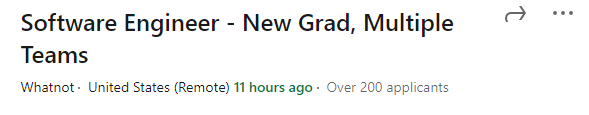
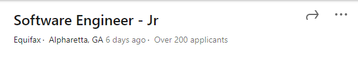
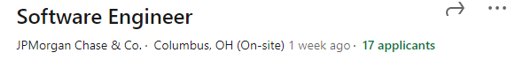

# { On the Other Side }

#### Two Years in the Software Industry

---

# { Will I get the job? }

---

# { Finding a Job }

- Started before graduation
- Made ~26 applications
- Found success through networking and locality

---

# { Can I do the job? }

- It's just programming
- Keep learning
- You can ask for the answer to the problem
- Deadlines are often flexible

---

# { Will I find a good company? }

- Resource Data, Inc
- Based in Anchorage
- Variety of industries and projects
- Stable and comfortable
- Not flashy, but sill far reaching

---

# { What should I learn? }

- Whatever your target company uses
- Databases
- Cloud Technologies

---

# { What Do You Want to Know? }

- munderwood@resourcedata.com
- UAF Discord @Mark Underwood
- LinkedIn https://www.linkedin.com/in/mark-t-underwood
- https://www.resourcedata.com/
